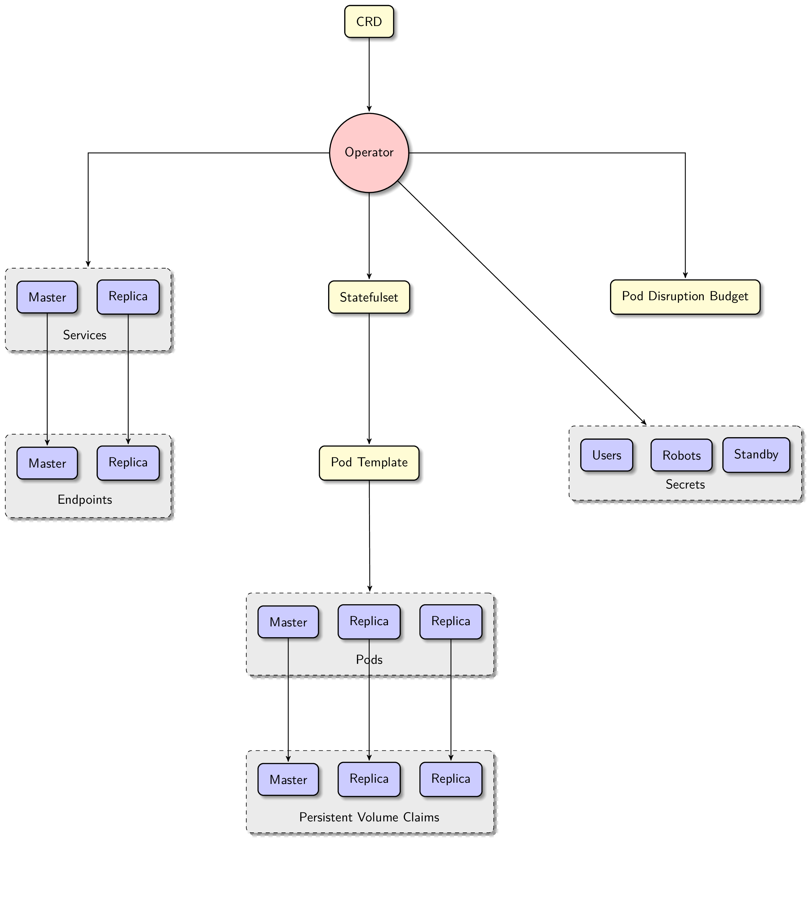

# Postgres Operator

[](https://travis-ci.org/zalando-incubator/postgres-operator)
[](https://coveralls.io/github/zalando-incubator/postgres-operator)
[](https://goreportcard.com/report/github.com/zalando-incubator/postgres-operator)
[](https://godoc.org/github.com/zalando-incubator/postgres-operator)
[](https://golangci.com/r/github.com/zalando-incubator/postgres-operator)

## Introduction

The Postgres [operator](https://coreos.com/blog/introducing-operators.html)
manages PostgreSQL clusters on Kubernetes:

1. The operator watches additions, updates, and deletions of PostgreSQL cluster
   manifests and changes the running clusters accordingly.  For example, when a
   user submits a new manifest, the operator fetches that manifest and spawns a
   new Postgres cluster along with all necessary entities such as Kubernetes
   StatefulSets and Postgres roles.  See this
   [Postgres cluster manifest](manifests/complete-postgres-manifest.yaml)
   for settings that a manifest may contain.

2. The operator also watches updates to [its own configuration](manifests/configmap.yaml)
   and alters running Postgres clusters if necessary.  For instance, if a pod
   docker image is changed, the operator carries out the rolling update.  That
   is, the operator re-spawns one-by-one pods of each StatefulSet it manages
   with the new Docker image.

3. Finally, the operator periodically synchronizes the actual state of each
   Postgres cluster with the desired state defined in the cluster's manifest.

Here is a diagram, that summarizes what would be created by the operator, when a
new Postgres cluster CRD was submitted:



There is a browser-friendly version of this documentation at
[postgres-operator.readthedocs.io](https://postgres-operator.readthedocs.io)

## Table of contents

* [concepts](docs/index.md)
* [user documentation](docs/user.md)
* [administrator documentation](docs/administrator.md)
* [developer documentation](docs/developer.md)
* [operator configuration reference](docs/reference/operator_parameters.md)
* [cluster manifest reference](docs/reference/cluster_manifest.md)
* [command-line options and environment variables](docs/reference/command_line_and_environment.md)

the rest of the document is a tutorial to get you up and running with the operator on Minikube.

## Quickstart

Prerequisites:

* [minikube](https://github.com/kubernetes/minikube/releases)
* [kubectl](https://kubernetes.io/docs/tasks/tools/install-kubectl/#install-kubectl-binary-via-curl)

Note that you can also use built-in Kubernetes support in the Docker Desktop
for Mac to follow the steps of this tutorial. You would have to replace
`minikube start` and `minikube delete` with your launch actionsfor the Docker
built-in Kubernetes support.

### Local execution

```bash
git clone https://github.com/zalando-incubator/postgres-operator.git
cd postgres-operator

minikube start

# start the operator; may take a few seconds
kubectl create -f manifests/configmap.yaml  # configuration
kubectl create -f manifests/operator-service-account-rbac.yaml  # identity and permissions
kubectl create -f manifests/postgres-operator.yaml  # deployment

# create a Postgres cluster in a non-default namespace
kubectl create namespace test
kubectl config set-context minikube --namespace=test
kubectl create -f manifests/minimal-postgres-manifest.yaml

# connect to the Postgres master via psql
# operator creates the relevant k8s secret
export HOST_PORT=$(minikube service --namespace test acid-minimal-cluster --url | sed 's,.*/,,')
export PGHOST=$(echo $HOST_PORT | cut -d: -f 1)
export PGPORT=$(echo $HOST_PORT | cut -d: -f 2)
export PGPASSWORD=$(kubectl get secret postgres.acid-minimal-cluster.credentials -o 'jsonpath={.data.password}' | base64 -d)
psql -U postgres

# tear down cleanly
minikube delete
```

We have automated starting the operator and submitting the `acid-minimal-cluster` for you:
```bash
cd postgres-operator
./run_operator_locally.sh
```

Note we provide the `/manifests` directory as an example only; you should consider adjusting the manifests to your particular setting.

## Running and testing the operator

The best way to test the operator is to run it locally in [minikube](https://kubernetes.io/docs/getting-started-guides/minikube/). See developer docs(`docs/developer.yaml`) for details.

### Configuration Options

The operator can be configured with the provided ConfigMap(`manifests/configmap.yaml`) or the operator's own CRD.


